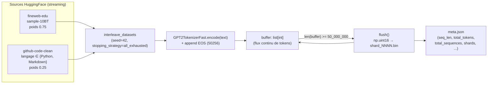
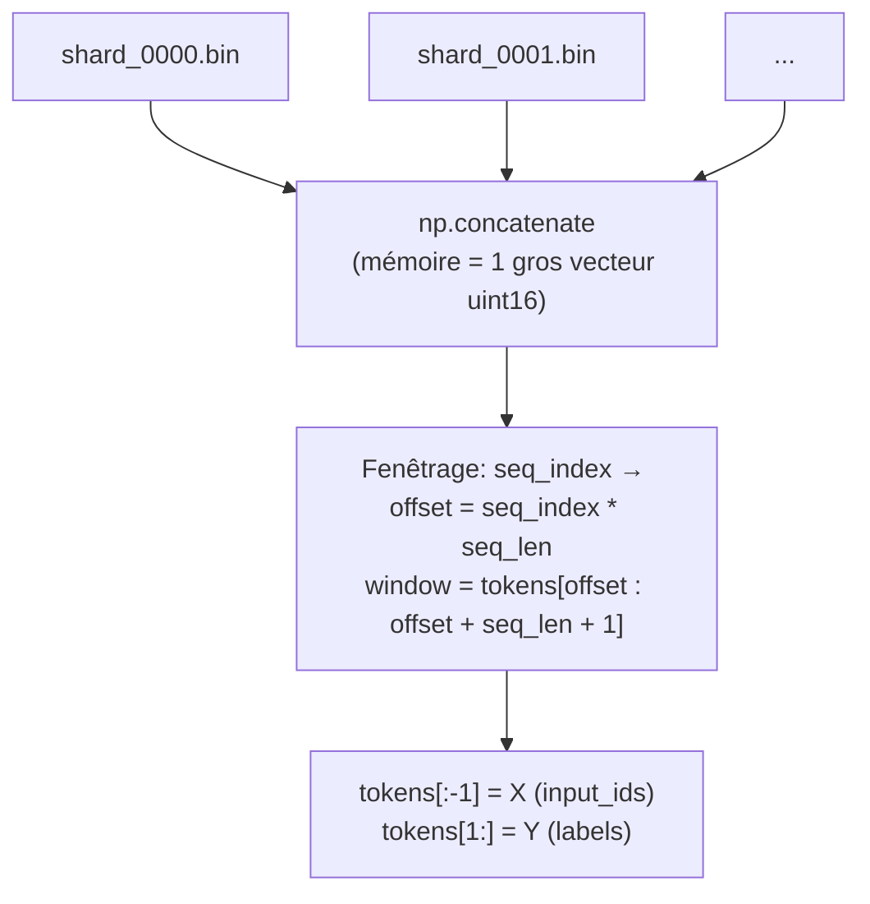
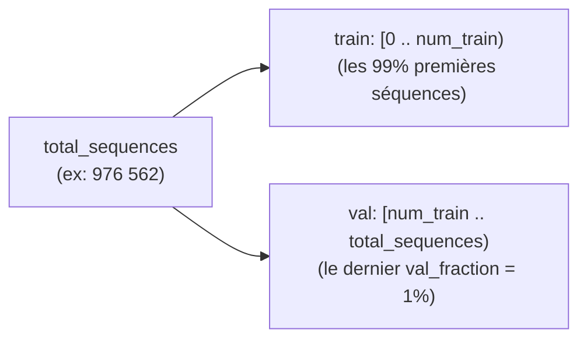
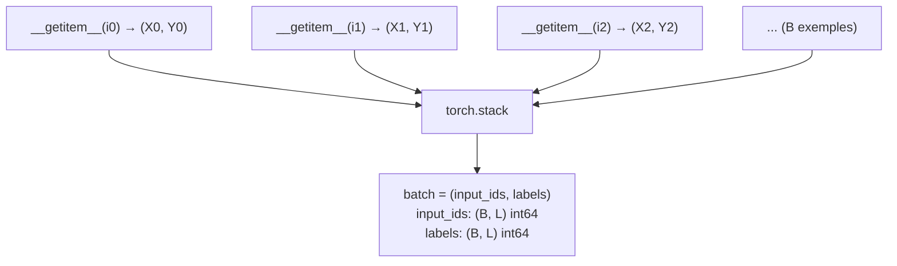
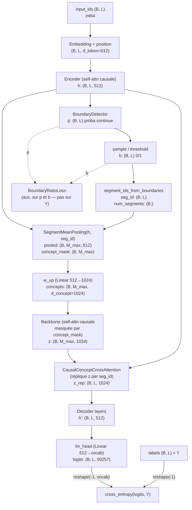

# Création des données DLCM — du texte brut au batch d'entraînement

Ce document décrit le pipeline de données du **DLCM** (`scripts/prepare_dlcm_data.py` →
`scripts/train_dlcm.py`), à ne pas confondre avec le pipeline SONAR du Base-LCM
(voir `docs/TRAINING_STRATEGY.md`). Le DLCM travaille directement sur des
**tokens GPT-2**, pas des embeddings de phrases : la donnée d'entraînement est
donc un simple flux de `uint16`, packé en shards binaires.

Code source :
- `lcm_explo/workflows/_data_tasks.py::prepare_token_shards_task`
- `lcm_explo/adapters/dataset/packed_tokens/_class.py::PackedTokensDataset`
- `lcm_explo/domain/usecases/train/train_dlcm.py::DLCMTrainingModule`

Les diagrammes ci-dessous sont rendus inline (mermaid), mais leur source `.mmd`
et un export `.png` sont aussi disponibles dans
[`docs/assets/dataset_creation/`](assets/dataset_creation/) pour les réutiliser
hors GitHub (slides, PDF, etc.). Régénérer les PNG :
`./docs/assets/dataset_creation/render.sh` (télécharge Chromium via puppeteer
au premier lancement — à faire manuellement, pas en CI).

---

## 1. Vue d'ensemble du pipeline



Points clés :

- **Un seul flux de tokens**, pas de notion de "document" au niveau du stockage :
  chaque document est simplement suivi d'un token `EOS` (`50256`), puis tout est
  concaténé dans un unique buffer.
- Les **shards** (`shard_0000.bin`, `shard_0001.bin`, …) sont juste des tranches
  consécutives de ce flux, écrites dès que le buffer atteint `_SHARD_TOKENS =
  50_000_000` tokens (~100 Mo en `uint16`). Ce n'est **pas** un découpage
  sémantique — un document peut très bien être coupé en deux entre la fin d'un
  shard et le début du suivant.
- `meta.json` est écrit **en dernier** : sa présence sert de marqueur "préparation
  terminée", ce qui permet de relancer le script sans dupliquer le travail.

```json
{
  "seq_len": 1024,
  "dtype": "uint16",
  "total_tokens": 999999999,
  "total_sequences": 976562,
  "val_fraction": 0.01,
  "tokenizer": "gpt2",
  "sources": [ /* ... */ ],
  "shards": ["shard_0000.bin", "shard_0001.bin", "..."]
}
```

---

## 2. Du flux de tokens aux fenêtres (X, Y)

`PackedTokensDataset` (le `Dataset` PyTorch) ne relit pas les shards à chaque
`__getitem__` : au chargement, il fait un `np.memmap` par shard puis les
concatène (`np.concatenate`) en un seul grand tableau 1-D `self._tokens`. Chaque
"exemple" est ensuite une **fenêtre non-chevauchante de `seq_len + 1` tokens**.



Le décalage de **1 seul token** entre `X` et `Y` est le mécanisme standard de
prédiction du token suivant : `Y[i] = X[i+1]`, donc à la position `i`, la cible
est le token qui suit réellement dans le texte.

### Exemple concret (seq_len = 4)

Flux de tokens (10 tokens, pour l'exemple) : `[t0, t1, t2, t3, t4, t5, t6, t7, t8, t9]`
→ `total_sequences = (10 - 1) // 4 = 2`

| séquence | offset | fenêtre (5 tokens) | X (input_ids) | Y (labels) |
|---|---|---|---|---|
| 0 | 0 | `[t0,t1,t2,t3,t4]` | `[t0,t1,t2,t3]` | `[t1,t2,t3,t4]` |
| 1 | 4 | `[t4,t5,t6,t7,t8]` | `[t4,t5,t6,t7]` | `[t5,t6,t7,t8]` |

Remarque : `t4` apparaît à la fois comme dernier `Y` de la séquence 0 et premier
`X` de la séquence 1 — c'est le seul point de recouvrement, il permet de ne
jamais perdre une paire `(contexte, cible)` à la frontière entre deux fenêtres.
`t9` n'est jamais utilisé (pas assez de tokens pour former une fenêtre complète
supplémentaire) : c'est pour ça que le calcul est `(total_tokens - 1) // seq_len`
et non une division simple.

### Split train / val

Le split se fait **par index de séquence, sur la queue du flux** (pas un
shuffle aléatoire) :



`num_train`/`num_val` découpent donc le corpus chronologiquement : la validation
porte toujours sur les derniers tokens écrits, jamais sur un sous-ensemble
mélangé avec le train.

---

## 3. Construction du batch

`DataLoader` tire des indices de séquence (mélangés par l'échantillonneur côté
train), appelle `__getitem__` sur chacun, puis `packed_tokens_collate_fn`
empile les paires `(X, Y)` :

```python
def packed_tokens_collate_fn(batch):
    input_ids = torch.stack([item[0] for item in batch])  # (B, L)
    labels    = torch.stack([item[1] for item in batch])  # (B, L)
    return input_ids, labels
```



Avec `seq_len = 1024` et `micro_batch_size = 4` :

```
input_ids.shape == (4, 1024)   # int64, valeurs dans [0, 50257)
labels.shape    == (4, 1024)   # int64, labels[b, i] == input_ids[b, i+1] du flux original
```

Aucun padding, aucun masque d'attention à passer au niveau des données : chaque
ligne du batch est une fenêtre pleine de `seq_len` tokens. Le padding qui existe
plus loin (`concept_mask` dans `DLCMSegmenter`) est généré **à l'intérieur du
modèle**, pas dans le pipeline de données — il compense le fait que chaque
séquence produit un nombre différent de concepts après segmentation dynamique.

---

## 4. Ce que `training_step` fait de (X, Y)

```python
def training_step(self, batch, batch_idx):
    input_ids, labels = batch                 # (B, L), (B, L)
    out = self.model(input_ids)                # forward sur X uniquement
    ce = F.cross_entropy(out.logits.reshape(-1, vocab), labels.reshape(-1))
    aux, f_rate, g = self.aux_loss(out.boundary_probs, out.boundaries)
    loss = ce + self.aux_loss_weight * aux
```

`labels` (Y) n'intervient **qu'à la toute fin**, dans la cross-entropy — jamais
dans le forward. Voici comment `X` (`input_ids`) se transforme en `logits` en
traversant le modèle, avec les formes de tenseurs à chaque étage :



Deux choses à retenir sur `Y` :

- `Y` ne sert que pour la `cross_entropy` (`ce`) — un signal purement "modélisation
  du langage".
- La loss auxiliaire (`aux`, qui pilote le ratio de compression `R≈4`) ne dépend
  **que** de `boundary_probs`/`boundaries`, donc uniquement de `X` — pas de `Y`.
  C'est cohérent avec le découpage des gradients documenté dans
  `docs/DLCM_EXPLICATION.md` §5.3 : les projections `W_q`/`W_k` du détecteur de
  frontières n'ont aucun lien avec la prédiction du token suivant.

---

## 5. Où toucher pour changer la donnée

| Je veux... | Fichier / paramètre |
|---|---|
| Changer le mélange de sources (poids, ajouter un dataset) | `sources` dans `PrepareDlcmTokensConfig` / `prepare_token_shards_task` |
| Changer la longueur de contexte | `--seq-len` (CLI) ou `seq_len` dans `meta.json` (nécessite de régénérer les shards) |
| Changer la taille de la validation | `--val-fraction` |
| Changer le tokenizer | `--tokenizer-name` (attention : `vocab_size` dans `DLCMConfig` doit rester cohérent) |
| Ne pas couper un document au milieu d'une fenêtre | non géré actuellement — packing "naïf" par flux continu, cf. point de vigilance dans `docs/IMPLEMENTATION_REVIEW.md` |

Pour inspecter manuellement un batch :

```python
from lcm_explo.adapters.dataset.packed_tokens._class import PackedTokensDataset

ds = PackedTokensDataset("notebooks/data/dlcm_tokens", split="train")
x, y = ds[0]
print(x.shape, y.shape)   # torch.Size([1024]) torch.Size([1024])
print(x[:5], y[:5])       # y[i] == x[i+1]
```
